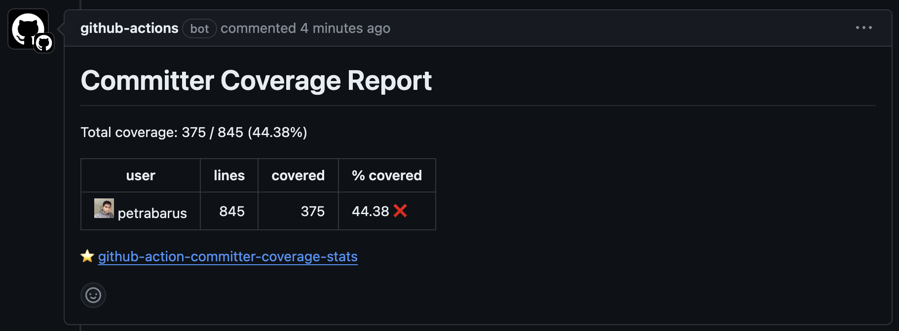

# Committers Code Coverage Stats GitHub Action
Github action to analyze the code coverage of the committers in a repository.

## 1. Inputs

### 1.1 `min_threshold`

The minimum threshold for the committers' code coverage percentage. If the code coverage percentage of a committer is below this threshold, the committer will be considered as a failing committer.

Default: `80`

### 1.2 `coverage_files`

The list of coverage files to be analyzed. The coverage files should be in the format of `path/to/coverage.xml`. Multiple coverage files can be provided by separating them with a comma.
At the moment, this only supports Cobertura XML format.

Default: `coverage.xml`

## 2. Outputs

This action will post a comment on the pull request with the list of committers and their code coverage percentage.



## 3. Example Usage

```yaml
```

## 4. Troubleshooting

## 5. License

[BSD 2-Clause License](https://opensource.org/license/bsd-2-clause)